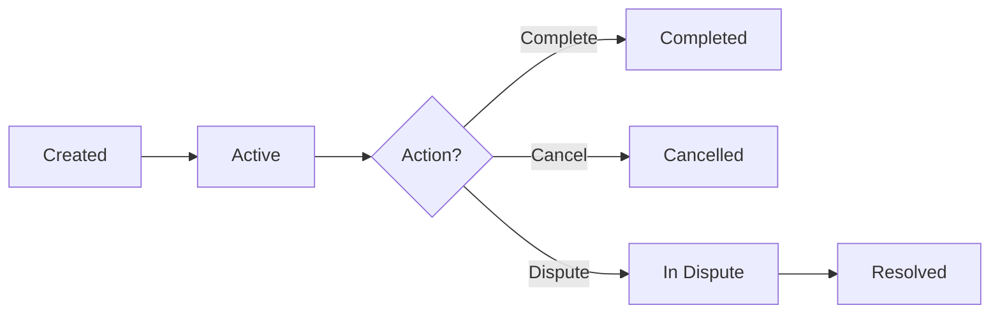

# 🔐 Zorah - Secure Escrow & Payment Protocol


> A next-generation decentralized escrow and payment system built for the Moonbeam ecosystem, featuring dispute resolution, automated vaults, and gasless transactions.

---

## 📋 Table of Contents

- [✨ Features](#-features)
- [🏗️ Architecture](#️-architecture)
- [🔑 Key Components](#-key-components)
- [🚀 Deployment Guide](#-deployment-guide)
- [📝 Contract Configuration](#-contract-configuration)
- [💡 Usage Examples](#-usage-examples)
- [🔒 Security Features](#-security-features)
- [📊 Events](#-events)
- [🛠️ Testing](#️-testing)
- [📄 License](#-license)

---

## ✨ Features

### 🎯 Core Capabilities

- **💰 Escrow Management**: Secure peer-to-peer transactions with time-locked escrows
- **⚖️ Dispute Resolution**: Decentralized jury system with fair voting mechanisms
- **🏦 Automated Vaults**: Premium user vaults for automated escrow creation
- **✍️ Gasless Transactions**: EIP-712 signatures and EIP-3009 support for meta-transactions
- **🔄 Internal Transfers**: Gas-efficient transfers between platform users
- **💎 Yield Integration**: Funds can be allocated for yield generation strategies
- **👥 Role-Based Access**: Granular permission system (Admin, Relayer, Juror, Premium)
- **🛡️ Security First**: ReentrancyGuard, Pausable, and comprehensive access controls

### 🌟 Advanced Features

- **Multi-token support** with configurable token whitelist
- **Configurable fee structures** (escrow fees, dispute penalties, LP rewards)
- **Flexible dispute resolution** with quorum-based voting
- **Reward distribution** for winning jurors
- **Blacklist mechanism** for security
- **Emergency pause** functionality

---

## 🏗️ Architecture

```
┌─────────────────────────────────────────────────────────────┐
│                     ZORAH PROTOCOL                          │
├─────────────────────────────────────────────────────────────┤
│                                                             │
│  ┌──────────────┐  ┌──────────────┐  ┌──────────────┐    │
│  │   User       │  │   Escrow     │  │   Dispute    │    │
│  │   Balances   │  │   Manager    │  │   System     │    │
│  └──────────────┘  └──────────────┘  └──────────────┘    │
│         │                  │                  │            │
│         └──────────────────┴──────────────────┘            │
│                            │                                │
│                  ┌─────────┴─────────┐                     │
│                  │  Role Management  │                     │
│                  │  (AccessControl)  │                     │
│                  └───────────────────┘                     │
│                                                             │
└─────────────────────────────────────────────────────────────┘
```

---

## 🔑 Key Components

### 👤 User Roles

| Role | Capabilities | Description |
|------|-------------|-------------|
| 🔴 **ADMIN** | Full configuration control | Can update fees, add tokens, pause contract |
| 🔵 **RELAYER** | Transaction orchestration | Creates escrows, resolves disputes, manages roles |
| ⚖️ **JUROR** | Dispute voting | Votes on disputes and earns rewards |
| 💎 **PREMIUM_USER** | Automated vaults | Access to automated vault features |

### 💼 Escrow States



### 📊 Fee Structure

- **Escrow Fee**: 0.5% (50 basis points) - capped at 10 USDC
- **Dispute Penalty**: 10% of disputed amount
- **Admin Share**: 10% of dispute penalties
- **Juror Rewards**: 90% of dispute penalties (distributed among winning voters)

---

## 🚀 Deployment Guide

### 📦 Prerequisites

```bash
# Required tools
- Node.js >= 18.x
- npm or yarn
- Hardhat or Foundry
- MetaMask or compatible wallet
```

### 🔧 Installation

1. **Install Dependencies**

```bash
npm install --save-dev @openzeppelin/contracts
npm install --save-dev hardhat @nomiclabs/hardhat-ethers ethers
```

2. **Configure Network**

Create or update `hardhat.config.js`:

```javascript
require("@nomiclabs/hardhat-ethers");

module.exports = {
  solidity: {
    version: "0.8.30",
    settings: {
      optimizer: {
        enabled: true,
        runs: 200
      }
    }
  },
  networks: {
    moonbeam: {
      url: "https://rpc.api.moonbeam.network",
      chainId: 1284,
      accounts: [process.env.PRIVATE_KEY]
    },
    moonriver: {
      url: "https://rpc.api.moonriver.moonbeam.network",
      chainId: 1285,
      accounts: [process.env.PRIVATE_KEY]
    },
    moonbase: {
      url: "https://rpc.api.moonbase.moonbeam.network",
      chainId: 1287,
      accounts: [process.env.PRIVATE_KEY]
    }
  }
};
```

3. **Environment Setup**

Create `.env` file:

```bash
PRIVATE_KEY=your_deployer_private_key_here
ADMIN_ADDRESS=0x...  # Admin wallet address
RELAYER_ADDRESS=0x...  # Relayer wallet address
ETHERSCAN_API_KEY=your_moonscan_api_key  # For verification
```

### 🚢 Deployment Script

Create `scripts/deploy.js`:

```javascript
const hre = require("hardhat");

async function main() {
  console.log("🚀 Deploying Zorah Escrow Contract to Moonbeam...");

  const adminAddress = process.env.ADMIN_ADDRESS;
  const relayerAddress = process.env.RELAYER_ADDRESS;

  // Validate addresses
  if (!adminAddress || !relayerAddress) {
    throw new Error("❌ Admin and Relayer addresses must be set in .env");
  }

  // Get the contract factory
  const Zorah = await hre.ethers.getContractFactory("Zorah");
  
  // Deploy
  console.log("📝 Deploying with admin:", adminAddress);
  console.log("📝 Deploying with relayer:", relayerAddress);
  
  const zorah = await Zorah.deploy(adminAddress, relayerAddress);
  await zorah.deployed();

  console.log("✅ Zorah deployed to:", zorah.address);
  console.log("🔗 Transaction hash:", zorah.deployTransaction.hash);

  // Wait for confirmations
  console.log("⏳ Waiting for confirmations...");
  await zorah.deployTransaction.wait(5);

  console.log("✨ Deployment completed!");
  console.log("\n📋 Next Steps:");
  console.log("1. Add supported tokens via addSupportedToken()");
  console.log("2. Configure jurors via addJuror()");
  console.log("3. Set up premium users if needed");
  console.log("4. Verify contract on Moonscan");
  
  // Return deployment info
  return {
    address: zorah.address,
    admin: adminAddress,
    relayer: relayerAddress
  };
}

main()
  .then(() => process.exit(0))
  .catch((error) => {
    console.error("❌ Deployment failed:", error);
    process.exit(1);
  });
```

### 🎯 Deploy to Moonbeam

```bash
# Deploy to Moonbeam Mainnet
npx hardhat run scripts/deploy.js --network moonbeam

# Deploy to Moonriver
npx hardhat run scripts/deploy.js --network moonriver

# Deploy to Moonbase Alpha (Testnet)
npx hardhat run scripts/deploy.js --network moonbase
```

### ✔️ Verify Contract

```bash
# Verify on Moonscan
npx hardhat verify --network moonbeam DEPLOYED_CONTRACT_ADDRESS "ADMIN_ADDRESS" "RELAYER_ADDRESS"
```

---

## 📝 Contract Configuration

### 🎛️ Initial Setup

After deployment, configure the contract:

```javascript
// 1. Add supported tokens
// For Mainnet: xcUSDC, xcUSDT, etc.
await zorah.addSupportedToken("0x818ec0A7Fe18Ff94269904fCED6AE3DaE6d6dC0b"); // xcUSDC on Moonbeam

// For Testnet (Moonbase Alpha): aUSDC
// await zorah.addSupportedToken("AUSDC_TOKEN_ADDRESS"); // aUSDC on Moonbase Alpha

// 2. Add jurors
await zorah.addJuror("0xJurorAddress1");
await zorah.addJuror("0xJurorAddress2");

// 3. Add premium users
await zorah.addPremiumUser("0xPremiumUserAddress");

// 4. Configure fees (optional)
await zorah.updateConfig(
  true, 50,      // escrowFeePercentage (0.5%)
  true, 10e6,    // maxEscrowFee (10 USDC with 6 decimals)
  true, 10,      // disputePenaltyPercentage (10%)
  true, 90,      // quorumPercentage (90%)
  true, 50       // lpRewardFeePercentage (0.5%)
);
```

### 🔐 Supported Tokens

#### Moonbeam Mainnet

| Token | Address | Decimals |
|-------|---------|----------|
| xcUSDC | `0x818ec0A7Fe18Ff94269904fCED6AE3DaE6d6dC0b` | 6 |
| xcUSDT | `0xeFAeeE334F0Fd1712f9a8cc375f427D9Cdd40d73` | 6 |
| WGLMR | `0xAcc15dC74880C9944775448304B263D191c6077F` | 18 |

#### Moonbase Alpha Testnet

| Token | Address | Decimals |
|-------|---------|----------|
| aUSDC | `TBA` | 6 |

---

## 💡 Usage Examples

### 📥 Deposit Funds

```javascript
// Approve token first
await token.approve(zorahAddress, amount);

// Deposit to standard balance
await zorah.deposit(tokenAddress, amount, false);

// Deposit to automated vault (premium users only)
await zorah.deposit(tokenAddress, amount, true);
```

### 🤝 Create Escrow

```javascript
// Create escrow (relayer only)
const tx = await zorah.createEscrow(
  sellerAddress,
  buyerAddress,
  tokenAddress,
  amount,
  duration,     // in seconds (max 30 days)
  isAutomated   // true for vault escrows
);

const receipt = await tx.wait();
const escrowId = receipt.events[0].args.escrowId;
```

### ✅ Complete Escrow

```javascript
// Release funds to buyer
await zorah.completeEscrow(
  escrowId,
  buyerAddress,  // destination
  false          // yield: false = direct transfer, true = deposit to balance
);
```

### ⚠️ Handle Disputes

```javascript
// 1. Create dispute (relayer)
await zorah.createDispute(escrowId);

// 2. Jurors vote
await zorah.voteOnDispute(disputeId, true); // true = seller wins

// 3. Claim rewards (after resolution)
await zorah.claimDisputeReward(disputeId);
```

### 💸 Withdraw Funds

```javascript
// Withdraw from standard balance
await zorah.withdrawToWallet(tokenAddress, amount, false);

// Withdraw from automated vault
await zorah.withdrawToWallet(tokenAddress, amount, true);
```

---

## 🔒 Security Features

### 🛡️ Protection Mechanisms

- ✅ **ReentrancyGuard**: Prevents reentrancy attacks
- ✅ **Pausable**: Emergency stop mechanism
- ✅ **AccessControl**: Role-based permissions
- ✅ **SafeERC20**: Safe token transfers
- ✅ **Blacklist**: Block malicious actors
- ✅ **Time Locks**: Escrow expiry validation
- ✅ **Balance Tracking**: Internal accounting system

### 🔍 Audit Checklist

- [x] No direct token transfers without accounting
- [x] All state changes emit events
- [x] Protected against reentrancy
- [x] Emergency pause functionality
- [x] Role-based access control
- [x] Input validation on all public functions
- [x] Safe math operations (Solidity 0.8+)

---

## 📊 Events

### 💰 Financial Events

```solidity
event Deposited(address indexed user, IERC20 indexed token, uint256 amount);
event WithdrawnToWallet(address indexed user, IERC20 indexed token, uint256 amount);
event InternalTransferred(address indexed from, address indexed to, IERC20 indexed token, uint256 amount);
```

### 📦 Escrow Events

```solidity
event EscrowCreated(uint256 indexed escrowId, address indexed seller, address indexed buyer, uint256 amount, bool isAutomated);
event EscrowCompleted(uint256 indexed escrowId, uint256 fee);
event EscrowCancelled(uint256 indexed escrowId);
```

### ⚖️ Dispute Events

```solidity
event DisputeCreated(uint256 indexed disputeId, uint256 indexed escrowId, uint256 deadline);
event DisputeVoted(uint256 indexed disputeId, address indexed voter, bool vote);
event DisputeResolved(uint256 indexed disputeId, bool sellerWins, uint256 rewardPool, bytes32 fundDisbursement);
event RewardClaimed(uint256 indexed disputeId, address indexed juror, uint256 amount);
```

---

## 🛠️ Testing

### 🧪 Run Tests

```bash
# Compile contracts
npx hardhat compile

# Run tests
npx hardhat test

# Run with coverage
npx hardhat coverage

# Run with gas reporter
REPORT_GAS=true npx hardhat test
```

### 📝 Test Cases

Create `test/Zorah.test.js`:

```javascript
const { expect } = require("chai");
const { ethers } = require("hardhat");

describe("Zorah Escrow", function () {
  let zorah, token, admin, relayer, seller, buyer;

  beforeEach(async () => {
    [admin, relayer, seller, buyer] = await ethers.getSigners();
    
    // Deploy mock token
    const Token = await ethers.getContractFactory("MockERC20");
    token = await Token.deploy("Test USDC", "USDC", 6);
    
    // Deploy Zorah
    const Zorah = await ethers.getContractFactory("Zorah");
    zorah = await Zorah.deploy(admin.address, relayer.address);
    
    // Setup
    await zorah.connect(admin).addSupportedToken(token.address);
    await token.mint(seller.address, ethers.utils.parseUnits("1000", 6));
  });

  it("Should deposit and create escrow", async () => {
    const amount = ethers.utils.parseUnits("100", 6);
    
    // Deposit
    await token.connect(seller).approve(zorah.address, amount);
    await zorah.connect(seller).deposit(token.address, amount, false);
    
    // Create escrow
    await zorah.connect(relayer).createEscrow(
      seller.address,
      buyer.address,
      token.address,
      amount,
      86400, // 1 day
      false
    );
    
    const escrow = await zorah.getEscrow(1);
    expect(escrow.amount).to.equal(amount);
  });
  
  // Add more tests...
});
```

---

## 🌐 Moonbeam Network Details

### 📡 RPC Endpoints

| Network | RPC URL | Chain ID | Block Explorer |
|---------|---------|----------|----------------|
| 🌕 Moonbeam | `https://rpc.api.moonbeam.network` | 1284 | [moonscan.io](https://moonscan.io) |
| 🌊 Moonriver | `https://rpc.api.moonriver.moonbeam.network` | 1285 | [moonriver.moonscan.io](https://moonriver.moonscan.io) |
| 🧪 Moonbase Alpha | `https://rpc.api.moonbase.moonbeam.network` | 1287 | [moonbase.moonscan.io](https://moonbase.moonscan.io) |

### 💰 Gas & Fees

- **Gas Token**: GLMR (Moonbeam), MOVR (Moonriver), DEV (Moonbase)
- **Average Gas Price**: ~100 Gwei (dynamic)
- **Deployment Cost**: ~15-20 GLMR
- **Transaction Cost**: ~0.001-0.005 GLMR per transaction

---

## 📚 Additional Resources

### 🔗 Useful Links

- 📖 [Moonbeam Documentation](https://docs.moonbeam.network/)
- 🏗️ [OpenZeppelin Contracts](https://docs.openzeppelin.com/contracts/)
- 💬 [Moonbeam Discord](https://discord.gg/moonbeam)
- 🐦 [Moonbeam Twitter](https://twitter.com/MoonbeamNetwork)

### 🆘 Support

- **Issues**: Open an issue on GitHub
- **Security**: Report vulnerabilities to security@zorah.io
- **Community**: Join our Discord server

---

## 📄 License

This project is licensed under the MIT License.

```
MIT License

Copyright (c) 2024 Zorah Protocol

Permission is hereby granted, free of charge, to any person obtaining a copy
of this software and associated documentation files (the "Software"), to deal
in the Software without restriction, including without limitation the rights
to use, copy, modify, merge, publish, distribute, sublicense, and/or sell
copies of the Software, and to permit persons to whom the Software is
furnished to do so, subject to the following conditions:

The above copyright notice and this permission notice shall be included in all
copies or substantial portions of the Software.

THE SOFTWARE IS PROVIDED "AS IS", WITHOUT WARRANTY OF ANY KIND, EXPRESS OR
IMPLIED, INCLUDING BUT NOT LIMITED TO THE WARRANTIES OF MERCHANTABILITY,
FITNESS FOR A PARTICULAR PURPOSE AND NONINFRINGEMENT. IN NO EVENT SHALL THE
AUTHORS OR COPYRIGHT HOLDERS BE LIABLE FOR ANY CLAIM, DAMAGES OR OTHER
LIABILITY, WHETHER IN AN ACTION OF CONTRACT, TORT OR OTHERWISE, ARISING FROM,
OUT OF OR IN CONNECTION WITH THE SOFTWARE OR THE USE OR OTHER DEALINGS IN THE
SOFTWARE.
```

---

<div align="center">

### 🌟 Built with ❤️ for the Pokadot Moonbeam Ecosystem

</div>
